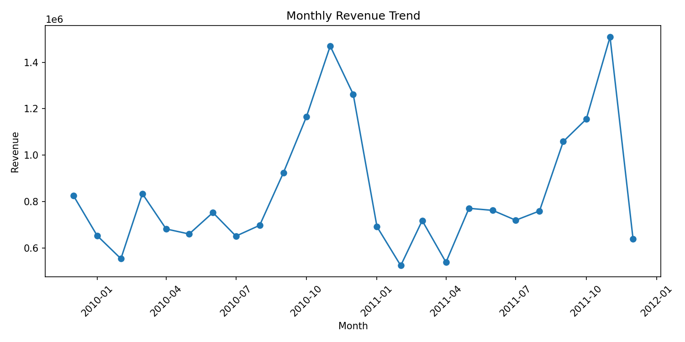
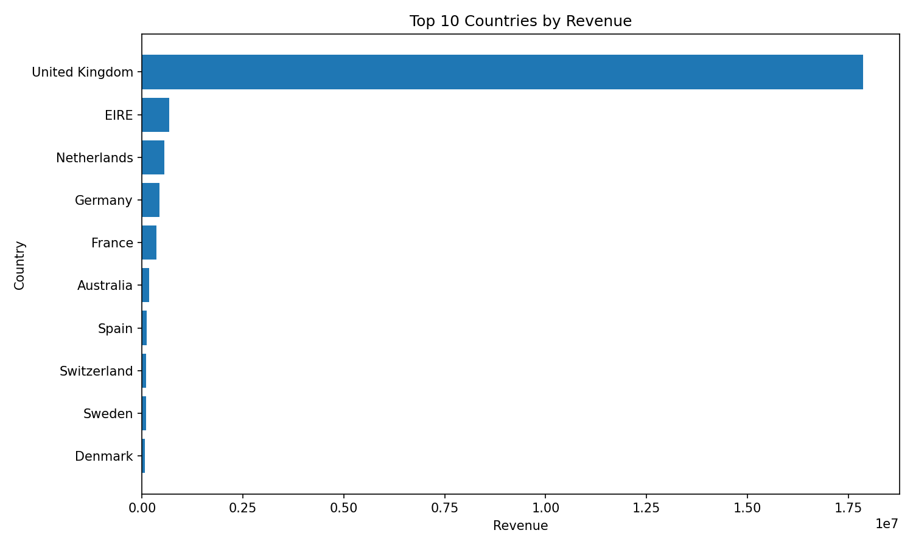
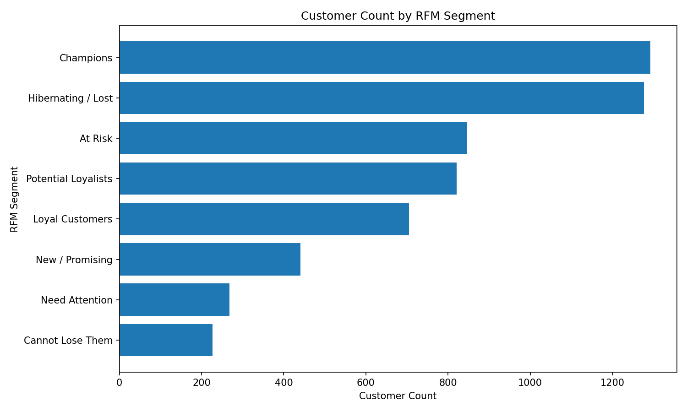
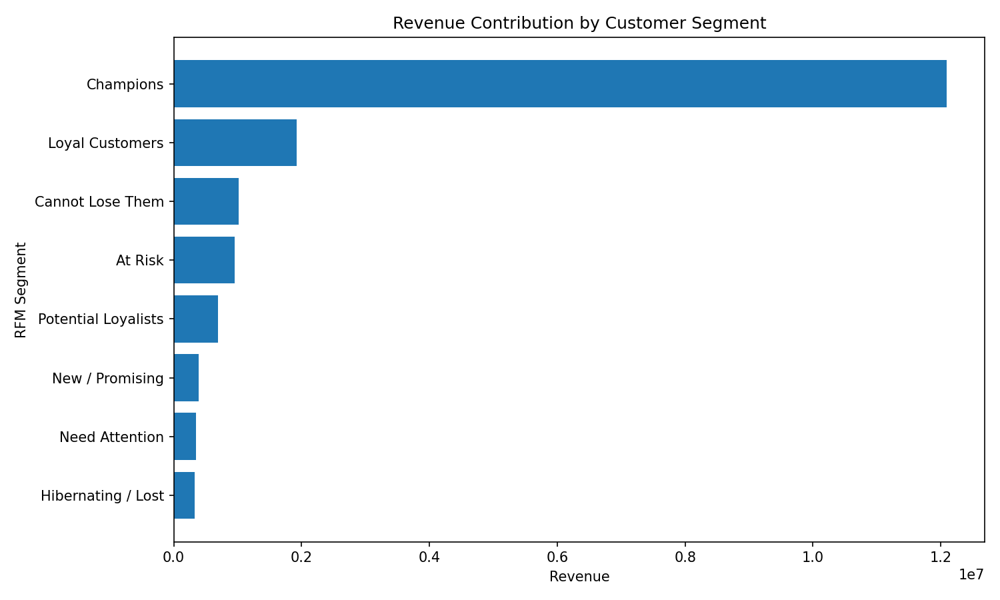

# Online Retail Sales & Customer Churn Analytics

## Project Overview

This project is an end-to-end retail analytics case study built on multi-year online retail transaction data. The goal is to transform raw invoice-level sales records into business-ready insights around **sales performance, customer segmentation, churn risk, product performance, and market contribution**.

The project simulates a real data analyst / BI analyst workflow: raw Excel data is cleaned with Python, customer-level features are engineered, SQL queries are prepared for KPI analysis, and processed outputs are generated for dashboarding and business reporting.

## Business Problem

Online retailers often have large volumes of transaction data, but the raw data alone does not directly answer business questions such as:

- Which months, countries, and products drive the most revenue?
- Which customers are the most valuable?
- Which customers are at risk of becoming inactive?
- How should the business prioritize retention and reactivation campaigns?
- Which processed datasets should be used for executive dashboards?

This project addresses those questions by creating a structured analytics pipeline and dashboard-ready output tables.

## Dataset

The source data is an Online Retail II-style transaction dataset containing two yearly worksheets:

| Sheet | Description |
|---|---|
| Year 2009-2010 | Invoice-level retail transactions |
| Year 2010-2011 | Invoice-level retail transactions |

Core fields include:

| Column | Description |
|---|---|
| Invoice | Invoice number; cancelled invoices may start with `C` |
| StockCode | Product identifier |
| Description | Product description |
| Quantity | Quantity purchased or returned |
| InvoiceDate | Transaction timestamp |
| Price | Unit price |
| Customer ID | Unique customer identifier |
| Country | Customer country |

The raw dataset contains more than **1 million transaction records** across two yearly sheets.

> Note: The raw Excel file is not included in this repository because of file size. The repository includes processed outputs generated from the analysis pipeline.

## Tools Used

| Category | Tools |
|---|---|
| Programming | Python |
| Data Processing | pandas, numpy |
| Excel Reading | openpyxl |
| SQL Analysis | SQL query templates |
| Notebook Analysis | Jupyter Notebook |
| BI / Dashboard Ready | Processed CSV outputs for Power BI or Tableau |
| Version Control | GitHub |

## Project Structure

```text
Online-Retail-Sales-Churn-Analytics/
│
├── data/
│   └── processed/
│       ├── country_performance.csv
│       ├── customer_rfm_segments.csv
│       ├── high_value_churn_risk_customers.csv
│       ├── monthly_sales_summary.csv
│       ├── product_performance_top200.csv
│       └── segment_summary.csv
│
├── notebooks/
│   ├── 01_data_cleaning_and_eda.ipynb
│   └── 02_rfm_churn_retention_analysis.ipynb
│
├── reports/
│   ├── dashboard_build_guide.md
│   └── executive_summary.md
│
├── sql/
│   ├── 02_sales_kpis.sql
│   ├── 03_customer_rfm.sql
│   └── 04_churn_features.sql
│
├── src/
│   ├── data_cleaning.py
│   ├── feature_engineering.py
│   ├── rfm_segmentation.py
│   ├── run_pipeline.py
│   └── visualization.py
│
├── PROJECT_PLAN.md
├── NEXT_UPLOAD_NOTES.md
├── README.md
└── requirements.txt
```

## Analysis Workflow

### 1. Data Cleaning

The raw Excel workbook is cleaned and standardized before analysis.

Main cleaning steps:

- Combined two yearly worksheets into one transaction table
- Standardized column names for easier analysis
- Converted invoice dates into datetime format
- Created revenue calculation: `quantity × unit price`
- Flagged cancelled or returned transactions
- Removed invalid records for sales KPI calculations
- Preserved relevant transaction details for product, customer, and country analysis

### 2. Sales KPI Analysis

The project generates sales performance outputs such as:

- Monthly revenue trend
- Order volume
- Active customer count
- Average order value
- Revenue by country
- Revenue by product
- Product quantity performance

Generated output:

```text
data/processed/monthly_sales_summary.csv
```

### 3. Customer RFM Segmentation

Customers are segmented using the RFM framework:

| Metric | Meaning |
|---|---|
| Recency | How recently a customer purchased |
| Frequency | How often a customer purchased |
| Monetary | How much revenue a customer generated |

The segmentation helps identify customer groups such as:

- Champions
- Loyal Customers
- Potential Loyalists
- At Risk
- Hibernating
- Lost Customers

Generated outputs:

```text
data/processed/customer_rfm_segments.csv
data/processed/segment_summary.csv
```

### 4. Churn Risk Analysis

Because this is transaction data rather than subscription data, churn risk is defined using customer inactivity.

The project labels customers as higher churn risk when they have not purchased within a defined recent activity window. It also identifies high-value inactive customers who may be good targets for reactivation campaigns.

Generated output:

```text
data/processed/high_value_churn_risk_customers.csv
```

### 5. Country and Product Performance

The project also produces market-level and product-level performance summaries.

Generated outputs:

```text
data/processed/country_performance.csv
data/processed/product_performance_top200.csv
```

## Key Outputs

## Visual Results

### Monthly Revenue Trend

Revenue shows strong seasonal peaks near year-end periods, suggesting holiday-driven demand and potential opportunities for seasonal inventory and marketing planning.



### Top Countries by Revenue



### RFM Segment Distribution



### Revenue Contribution by Customer Segment



| Output File | Purpose |
|---|---|
| `monthly_sales_summary.csv` | Monthly revenue, orders, customers, and sales KPIs |
| `customer_rfm_segments.csv` | Customer-level RFM scores and customer segments |
| `segment_summary.csv` | Segment-level customer count, revenue, and business value |
| `high_value_churn_risk_customers.csv` | High-value inactive customers for retention targeting |
| `country_performance.csv` | Country-level revenue and customer performance |
| `product_performance_top200.csv` | Top product performance by revenue and quantity |

## Business Recommendations

Based on the analysis design, the business can use this project to support the following decisions:

### 1. Prioritize high-value inactive customers

Customers with strong historical monetary value but long purchase recency should be targeted with reactivation campaigns, loyalty offers, or personalized promotions.

### 2. Build retention strategies by RFM segment

Different customer groups require different actions:

| Segment Type | Suggested Action |
|---|---|
| Champions | Loyalty rewards, early access, VIP campaigns |
| Loyal Customers | Cross-sell and upsell campaigns |
| Potential Loyalists | Welcome series and repeat-purchase incentives |
| At Risk | Win-back campaigns |
| Hibernating / Lost | Low-cost reactivation or suppression strategy |

### 3. Monitor country-level performance

Country-level sales and customer summaries can help guide market prioritization, regional marketing allocation, and localized campaign planning.

### 4. Track product performance and return risk

Top-selling products should be monitored for demand trends, while products with unusual cancellation or return behavior should be reviewed for pricing, description accuracy, or quality issues.

## How to Run This Project Locally

### 1. Clone or download this repository

```bash
git clone <repository-url>
cd Online-Retail-Sales-Churn-Analytics
```

### 2. Create a virtual environment

```bash
python -m venv .venv
```

Activate it on Windows:

```bash
.venv\Scripts\activate
```

### 3. Install dependencies

```bash
pip install -r requirements.txt
```

### 4. Add the raw dataset locally

Place the raw Excel file here:

```text
data/raw/online_retail_II.xlsx
```

### 5. Run the pipeline

```bash
python src/run_pipeline.py
```

Processed outputs will be saved to:

```text
data/processed/
```

## Dashboard Plan

The processed CSVs are designed to support a Power BI or Tableau dashboard with the following pages:

### Executive Overview

- Total revenue
- Monthly revenue trend
- Order volume
- Active customers
- Average order value

### Customer Segmentation

- RFM segment distribution
- Revenue by customer segment
- High-value customer table

### Churn Risk

- High-value inactive customers
- Churn-risk customer count by segment
- Revenue at risk

### Market and Product Performance

- Revenue by country
- Top products by revenue
- Product demand and quantity ranking

## Skills Demonstrated

- Python data cleaning and transformation
- Feature engineering for customer analytics
- RFM segmentation
- Churn-risk labeling
- Sales KPI development
- SQL-based analytical thinking
- Dashboard-ready data modeling
- GitHub project documentation
- Business insight communication

## Resume Highlights

Potential resume bullets based on this project:

- Built an end-to-end retail analytics project using Python, SQL, and dashboard-ready CSV outputs on 1M+ transaction records to analyze sales trends, customer segmentation, and churn risk.
- Cleaned and transformed multi-year invoice-level retail data, handling cancellation records, invalid transactions, missing customer identifiers, and revenue feature engineering.
- Developed RFM-based customer segmentation to identify high-value, loyal, at-risk, and inactive customer groups for targeted retention strategy.
- Generated processed KPI datasets covering monthly sales, country performance, product performance, segment summaries, and high-value churn-risk customers.
- Designed a BI-ready analytics pipeline and documentation structure suitable for Power BI or Tableau dashboard development.

## Next Improvements

Planned enhancements:

- Add Power BI dashboard screenshots
- Add cohort retention heatmap
- Add churn prediction model with logistic regression or random forest
- Add automated data validation checks
- Add executive summary with finalized business findings
